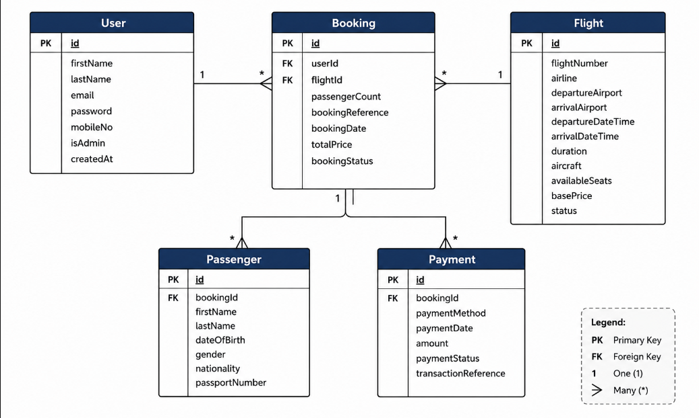

# Technical Specifications Document

## 1. Title Page

- **Project Name**: Airplane Flight Booking System
- **Version**: v1.0
- **Date**: July 17, 2026
- **Author(s)**: Cesar Bicol, Christian Parra, Civib Morilla, Jannah Sendrijas

## 2. Table of Contents

1. [Introduction](#3-introduction)
2. [Overall Description](#4-overall-description)
3. [Visual Mockup Reference](#5-visual-mockup-reference)
4. [Features](#6-features)
5. [Functional Requirements](#7-functional-requirements)
6. [Non-Functional Requirements](#8-non-functional-requirements)
7. [Data Requirements](#9-data-requirements)
8. [External Interface Requirements](#10-external-interface-requirements)
9. [Glossary](#11-glossary)
10. [Appendices](#12-appendices)

## 3. Introduction

- **Purpose**:
  The purpose of the Airplane Flight Booking System is to provide an online platform that enables travelers to search for available flights, compare flight options, book airline tickets, browse tour packages, and manage their reservations. The system aims to simplify the booking process by providing users with a convenient, secure, and efficient way to plan and manage their travel.
- **Scope**:
  The Airplane Flight Booking System is a web-based application designed to facilitate airline ticket reservations and tour package bookings. The system includes user registration and authentication, flight search, viewing flight schedules and details, booking flights, managing reservations, browsing tour packages, and user profile management. Administrative functions include managing flights, tour packages, schedules, bookings, and user accounts.

- **Definitions, Acronyms, and Abbreviations**:
  - API: Application Programming Interface
  - CRUD: Create, Read, Update, Delete
  - UI: User Interface
  - DBMS: Database Management System
  - SRS: Software Requirements Specification
  - JWT: JSON Web Token used for user authentication
  - HTTPS: Hypertext Transfer Protocol Secure
  - Tour Package: A travel package consisting of transportation, accommodations, and optional activities offered together.
  - Booking: A reservation made by a customer for a selected flight or tour package.

- **References**:
  - Node.js Documentation
  - Express.js Documentation
  - Vuejs Documentation
  - MongoDB Documentation
  - REST API Design Principles

## 4. Overall Description

- **Product Perspective**:
  The Airplane Flight Booking System is a standalone web application that allows an airline or travel agency to offer flight reservations and tour packages through an online platform. It serves as a centralized booking system where customers can search for flights, make reservations, and manage their bookings, while administrators oversee flights, bookings, schedules, and travel packages.

- **Product Functions**:
  User registration and secure login.
  Search for available flights based on departure, destination, and travel dates.
  View flight schedules.
  Book flights and receive booking confirmations.
  Browse and reserve available tour packages.
  View, update, or cancel existing bookings.
  Manage user profiles and booking history.
  Administrator management of flights, schedules, tour packages, bookings, and user accounts.
- **User Classes and Characteristics**:
  **Guest User**
  Can browse available flights and tour packages.
  Can view flight information.
  Must register or log in before making a booking.

  **Registered User**
  Can perform all guest user functions.
  Can create bookings (flights and tour packages).
  Can view booking history and manage bookings (view, cancel).
  Can manage profile information.

  **Administrator**
  Can perform all registered user functions.
  Can manage flights (add, edit, delete, view schedules).
  Can manage tour packages (add, edit, delete).
  Can manage bookings (view, update status).
  Can manage user accounts.

- **Operating Environment**:
  - **Server Environment**: Node.js runtime, Express.js backend framework, MongoDB database
  - **Client Environment**: Modern web browsers (Google Chrome, Microsoft Edge, Mozilla Firefox, Safari), Desktop and laptop computers, Mobile devices with responsive browser support
  - **Network Environment**:
    Internet connection
    HTTPS communication between client and server

- **Assumptions**:
  Users have a stable internet connection.
  Customers provide accurate personal and booking information.
  Administrators are authorized to manage system data.
  Flight schedules and pricing are maintained and updated by administrators.
- **Dependencies**:
  Node.js runtime environment.
  Express.js framework.
  MongoDB database and Mongoose ODM.
  Vuejs for the client application.
  JWT for authentication and authorization.
  Git for version control.
  A web browser that supports modern web standards.

## 5. Visual Mockup Reference

- **Link or Screenshot**: Provide a link to the visual mockup or include a screenshot.

## 6. Features

- **Feature 1: User Registration and Login**: Allows users to create an account, securely log in, and access personalized features such as their booking history and account information.

- **Feature 2: Flight Search**: Enables users to search for available flights by specifying the departure location, destination, travel date, and number of passengers. The system displays matching flights along with their schedules, fares, and seat availability.

- **Feature 3: Flight Booking**: Allows users to select an available flight, provide passenger information, review their booking details, and confirm their reservation. The system generates a unique booking reference upon successful booking.

- **Feature 4: Manage Booking**: Enables users to view their existing reservations and cancel eligible bookings. The system updates the booking status after a successful cancellation.

- **Feature 5: About**: Displays information about the airline, including its mission, services, contact details, customer support information, and frequently asked questions.

- **Feature 6: Admin Flight Management**: Allows administrators to create, update, and delete flight schedules while managing fares and seat availability.

## 7. Functional Requirements

**Use Cases:**

- **Use Case 1:**
  - **Title:** User Registration
  - **Description:** Allows new users to create an account by providing the required personal information and account credentials.
  - **Actors:** Customer
  - **Preconditions:**
    - The user does not have an existing account.
    - The registration page is accessible.
  - **Postconditions:**
    - A new user account is successfully created.
    - The user can log in to the system.
  - **Main Flow:**
    1. The user selects the **Sign Up** option.
    2. The system displays the registration form.
    3. The user enters the required personal information.
    4. The system validates the submitted information.
    5. The system creates the user account.
    6. The system displays a registration success message.
  - **Alternate Flows:**
    - The email address is already registered.
    - Required fields are incomplete.
    - The password does not meet the required criteria.

- **Use Case 2:**
  - **Title:** User Login
  - **Description:** Allows registered users and administrators to securely access the system using their account credentials.
  - **Actors:** Customer, Administrator
  - **Preconditions:**
    - The user has a registered account.
    - The account is active.
  - **Postconditions:**
    - The user is successfully authenticated and redirected to the appropriate dashboard.
  - **Main Flow:**
    1. The user selects the **Login** option.
    2. The user enters their email and password.
    3. The system validates the credentials.
    4. The system authenticates the user.
    5. The system redirects the user to the appropriate dashboard.
  - **Alternate Flows:**
    - The email or password is incorrect.
    - The account is inactive.

- **Use Case 3:**
  - **Title:** Search Flights
  - **Description:** Allows users to search for available flights based on their preferred travel details.
  - **Actors:** Customer
  - **Preconditions:**
    - Flight schedules are available in the system.
  - **Postconditions:**
    - The system displays all flights matching the user's search criteria.
  - **Main Flow:**
    1. The user enters the departure location.
    2. The user enters the destination.
    3. The user selects the travel date.
    4. The user specifies the number of passengers.
    5. The user initiates the search.
    6. The system displays all available flights matching the search criteria.
  - **Alternate Flows:**
    - No flights match the search criteria.
    - The user enters incomplete or invalid search information.

- **Use Case 4:**
  - **Title:** Book Flight
  - **Description:** Allows users to reserve seats on an available flight by providing passenger information and confirming the reservation.
  - **Actors:** Customer
  - **Preconditions:**
    - The user is logged in.
    - The selected flight has available seats.
  - **Postconditions:**
    - The booking is successfully created.
    - A unique booking reference is generated.
  - **Main Flow:**
    1. The user selects a preferred flight.
    2. The system displays the selected flight details.
    3. The user enters the passenger information.
    4. The system displays a booking summary.
    5. The user confirms the booking.
    6. The system records the reservation.
    7. The system displays the booking confirmation.
  - **Alternate Flows:**
    - The selected flight is no longer available.
    - Passenger information is incomplete or invalid.
    - The booking process cannot be completed due to a system error.

- **Use Case 5:**
  - **Title:** Manage Booking
  - **Description:** Allows users to view their existing reservations and cancel eligible bookings.
  - **Actors:** Customer
  - **Preconditions:**
    - The user is logged in.
    - The user has at least one existing booking.
  - **Postconditions:**
    - The selected booking is displayed or successfully cancelled.
  - **Main Flow:**
    1. The user opens the **Manage Booking** page.
    2. The system displays the user's current reservations.
    3. The user selects a reservation.
    4. The user views the booking details.
    5. The user may choose to cancel the reservation.
    6. The system requests confirmation.
    7. The user confirms the cancellation.
    8. The system updates the booking status.
    9. The system displays a cancellation confirmation message.
  - **Alternate Flows:**
    - The selected booking cannot be found.
    - The booking is no longer eligible for cancellation.
    - The user cancels the cancellation request.

- **Use Case 6:**
  - **Title:** View About Information
  - **Description:** Allows users and guests to access information about the airline, its services, contact details, and customer support.
  - **Actors:** Customer, Guest
  - **Preconditions:**
    - The system is operational.
  - **Postconditions:**
    - The requested information is displayed.
  - **Main Flow:**
    1. The user selects the **About** page.
    2. The system retrieves the airline information.
    3. The system displays the company's profile, services, contact information, and customer support details.
  - **Alternate Flows:**
    - The information is temporarily unavailable.

- **Use Case 7:**
  - **Title:** Admin Flight Management
  - **Description:** Allows administrators to manage flight schedules by creating, updating, and deleting flight records, as well as maintaining fares and seat availability.
  - **Actors:** Administrator
  - **Preconditions:**
    - The administrator is logged in.
  - **Postconditions:**
    - Flight information is successfully added, updated, or removed from the system.
  - **Main Flow:**
    1. The administrator logs into the system.
    2. The administrator opens the **Flight Management** page.
    3. The administrator selects an operation (Add, Edit, or Delete).
    4. The administrator enters or updates the required flight information.
    5. The system validates the submitted information.
    6. The system saves the changes.
    7. The system displays a confirmation message.
  - **Alternate Flows:**
    - The submitted flight information is invalid.
    - A duplicate flight schedule already exists.
    - The selected flight record cannot be found.

### System Features

- **Feature 1: User Registration and Login**
  - **Description:** Allows users to create an account and securely log in to access personalized services. Administrators can also log in to access system management functions.
  - **Priority:** High
  - **Inputs:**
    - First Name
    - Last Name
    - Email Address
    - Password
    - Mobile Number
    - Login Credentials (Email and Password)
  - **Processing:**
    - Validate all required fields.
    - Verify that the email address is unique during registration.
    - Encrypt the user's password before storing it.
    - Authenticate login credentials against stored user records.
    - Determine whether the user is a customer or administrator.
  - **Outputs:**
    - Successful account creation.
    - Successful login and redirection to the appropriate dashboard.
    - Authentication status message.
  - **Error Handling:**
    - Display an error if required fields are missing.
    - Display an error if the email is already registered.
    - Display an error for invalid login credentials.
    - Prevent unauthorized access.

- **Feature 2: Flight Search**
  - **Description:** Allows users to search for available flights using travel information such as departure location, destination, travel date, and passenger count.
  - **Priority:** High
  - **Inputs:**
    - Departure Location
    - Destination
    - Departure Date
    - Number of Passengers
  - **Processing:**
    - Validate search criteria.
    - Retrieve matching flight schedules.
    - Check seat availability.
    - Display available flights.
  - **Outputs:**
    - List of available flights.
    - Flight schedules.
    - Fare information.
    - Available seats.
  - **Error Handling:**
    - Display an error for incomplete search information.
    - Notify the user if no flights are available.
    - Handle system retrieval errors gracefully.

- **Feature 3: Flight Booking**
  - **Description:** Allows users to reserve seats on an available flight by providing passenger information and confirming the reservation.
  - **Priority:** High
  - **Inputs:**
    - Selected Flight
    - Passenger Information
    - Contact Information
  - **Processing:**
    - Validate passenger details.
    - Verify seat availability.
    - Create a booking record.
    - Generate a unique booking reference.
  - **Outputs:**
    - Booking confirmation.
    - Booking reference number.
    - Reservation details.
  - **Error Handling:**
    - Display an error if passenger information is incomplete.
    - Notify the user if seats are no longer available.
    - Prevent duplicate bookings.

- **Feature 4: Manage Booking**
  - **Description:** Allows users to view their reservations and cancel eligible bookings.
  - **Priority:** Medium
  - **Inputs:**
    - Booking Reference
    - Cancellation Request
  - **Processing:**
    - Retrieve booking information.
    - Verify booking eligibility for cancellation.
    - Update the booking status if cancelled.
  - **Outputs:**
    - Booking details.
    - Updated booking status.
    - Cancellation confirmation.
  - **Error Handling:**
    - Display an error if the booking cannot be found.
    - Notify the user if the booking is no longer eligible for cancellation.
    - Cancel the request if the user does not confirm.

- **Feature 5: About**
  - **Description:** Provides users with information about the airline, including company details, customer support, and contact information.
  - **Priority:** Low
  - **Inputs:**
    - User request to access the About page.
  - **Processing:**
    - Retrieve airline information from the system.
  - **Outputs:**
    - Company profile.
    - Contact information.
    - Customer support details.
    - Frequently Asked Questions (FAQ).
  - **Error Handling:**
    - Display a message if the information is temporarily unavailable.

- **Feature 6: Admin Flight Management**
  - **Description:** Allows administrators to create, update, and delete flight records while maintaining flight schedules, fares, and seat availability.
  - **Priority:** High
  - **Inputs:**
    - Flight Number
    - Origin
    - Destination
    - Departure Date and Time
    - Arrival Date and Time
    - Fare
    - Available Seats
  - **Processing:**
    - Validate flight information.
    - Create, update, or delete flight records.
    - Update seat availability.
    - Store changes in the database.
  - **Outputs:**
    - Updated flight records.
    - Confirmation of successful operation.
  - **Error Handling:**
    - Display an error for invalid flight information.
    - Prevent duplicate flight entries.
    - Notify the administrator if the selected flight does not exist.

## 8. Non-Functional Requirements
- **Performance**:
  - The application should load pages within 2 seconds under normal network conditions.
  - Flight search results should be returned within 3 seconds.
  - The system should support at least 200 concurrent users without significant performance degradation.
  - Database queries should be optimized using indexes for frequently searched fields (e.g., departure city, destination, departure date).
- **Security**:
  - User passwords must be hashed using bcrypt before being stored in the database.
  - All communication between the client and server must be encrypted using HTTPS.
  - User authentication should be implemented using JSON Web Tokens (JWT).
  - Role-based access control should restrict administrative functions to authorized administrators only.
  - Sensitive information such as API keys and database credentials must be stored in environment variables (.env).
- **Usability**:
  - The user interface should be responsive and accessible on desktop, tablet, and mobile devices.
  - Flight booking should be completed in **no more than five steps**.
  - Navigation should be intuitive with clear menus, buttons, and search filters.
  - Error messages should clearly explain issues and guide users toward resolution.
  - Confirmation messages should be displayed after successful bookings, payments, or cancellations.
- **Reliability**:
  - The application should maintain 99.9% availability during normal operations.
  - Database backups should be performed regularly to prevent data loss.
  - Failed transactions should not create duplicate bookings or inconsistent records.
  - The system should gracefully handle server or network failures with meaningful error responses.
- **Supportability**:
  - Source code should follow consistent coding standards and naming conventions.
  - APIs should be documented.
  - The project should be modular, making it easy to add future features.
  - Logging should be implemented for debugging, monitoring, and auditing purposes.
  - Unit and integration testing should be performed for critical application features.
  

## 9. Data Requirements

- **Data Models**:
  * User: { id, firstName, lastName, email, password, mobileNo, isAdmin, createdAt }
  * Flight: { id, flightNumber, airline, departureAirport, arrivalAirport, departureDateTime, arrivalDateTime, duration, aircraft, availableSeats, basePrice, status}
  * Booking: { id, userId, flightId, passengerCount, bookingReference, bookingDate, totalPrice, bookingStatus }
  * Passenger: { id, bookingId, firstName, lastName, dateOfBirth, gender, nationality, passportNumber }
  * Payment: { id, bookingId, paymentMethod, paymentDate, amount, paymentStatus, transactionReference }

- **Database Requirements**:
  *Database Choice*

  The application will use MongoDB as its primary database because it offers flexible document-based storage, making it suitable for handling user accounts, flights, bookings, passengers, and payment information.

  *Collections*

  - **Users Collection**
    - Stores customer and administrator accounts.
    - Passwords are stored as hashed values.

  - **Flights Collection**
    - Stores available flights, schedules, seat availability, pricing, and status.

  - **Bookings Collection**
    - Stores all flight reservations made by users.
    - References the User and Flight collections.

  - **Passengers Collection**
    - Stores passenger information associated with each booking.
    - Allows multiple passengers per booking.

  - **Payments Collection**
    - Stores payment transactions and payment status for each booking.

- **Data Storage and Retrieval**:
  - User information is securely stored in MongoDB with encrypted passwords.
  - Flight information can be searched using departure airport, arrival airport, travel date, airline, and price.
  - Bookings can be retrieved using the booking reference or authenticated user account.
  - Administrators can create, update, or remove flight schedules and manage bookings.
  - Seat availability is automatically updated after successful booking or cancellation.
  - Payment records are linked to bookings for transaction tracking.
  - Frequently searched flight data should be indexed to improve search performance.

- **Entity Relationship Diagram (ERD)**:

## 10. External Interface Requirements

- **User Interfaces**:

  - **Landing Page**: Search inputs, promo banners, and hero search fields.

  - **Search Results Page**: Left-side filter panel, flight result cards showing durations and prices.

  - **Passenger Details / Seat Map Page**: Forms for passenger details and the interactive clickable seat grid.

  - **Confirmation Page**: Showcases the passenger ticket design, flight details, and the 6-character PNR code.

  - **API Interfaces**: Integration with a mock Payment Gateway API (like Stripe Sandbox) to validate payment tokens.

  - **Hardware Interfaces**: None.

  - **Software Interfaces**: Database connections managed securely via Environment Variables (.env) to prevent exposing credentials.

## 11. Glossary
- **PNR (Passenger Name Record)**: A unique 6-character alphanumeric code that serves as the official reservation code.

- **IATA Code**: A 3-letter geographic location code defined by the International Air Transport Association to identify airports globally.

- **Double-Booking**: A system conflict state where the exact same seat on a specific flight is sold to two different customers.

## 12. Appendices
- **Supporting Information**:

  - **Upcoming additions**: Integration of email triggers using a service like SendGrid to deliver mock PDF boarding passes.

- **Revision History**:

  - **v1.0 (July 17, 2026)**: Initial document drafted for the core flight booking system specs.

